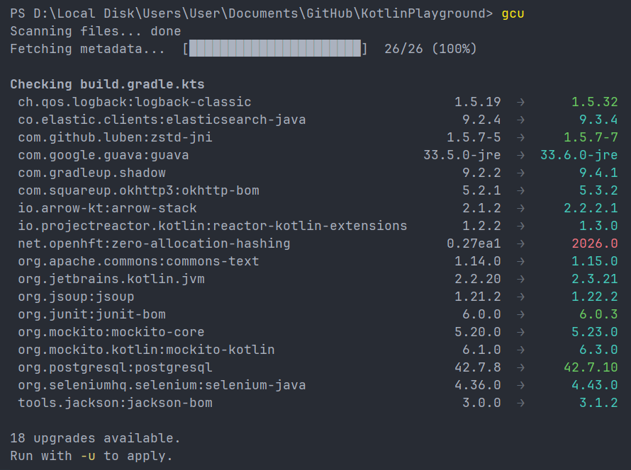
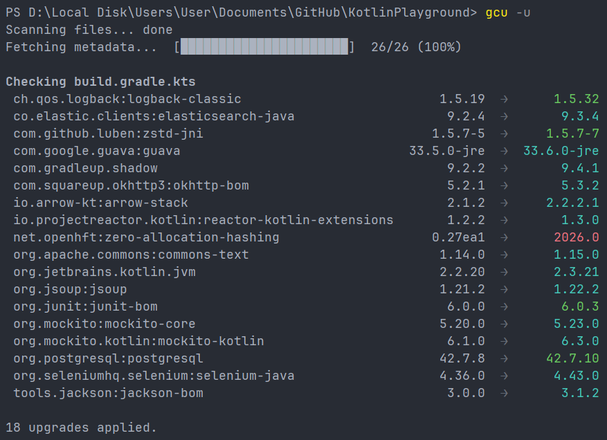
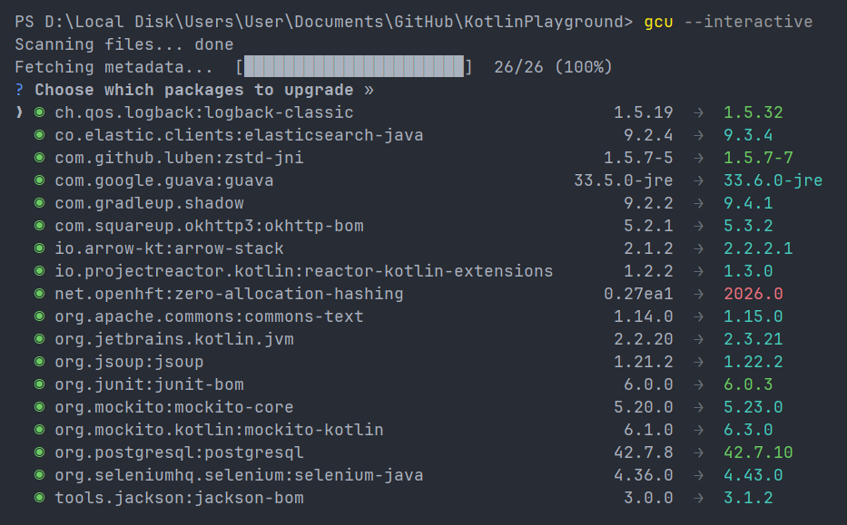

# gradle-check-updates

gradle-check-updates is a command-line tool for upgrading Gradle dependencies.

## Install

Install globally to use `gradle-check-updates` (or the `gcu` shorthand):
```sh
npm install -g gradle-check-updates
```

Or run with `npx`:
```sh
npx gradle-check-updates
```

## Quick Start

### Preview available upgrades
```sh
gcu
```


### Apply upgrades
```sh
gcu -u
```


### Interactive mode
```sh
gcu --interactive
gcu -i
```


## Options

| Option                  | Default | Description                                                    |
|-------------------------|---------|----------------------------------------------------------------|
| `[directory]`           | `.`     | Root directory to scan                                         |
| `-u, --upgrade`         | `false` | Write changes to disk                                          |
| `-i, --interactive`     | `false` | TUI picker to choose which deps to upgrade                     |
| `-c, --cooldown <days>` | `0`     | Skip versions newer than N days                                |
| `-t, --target <target>` | `major` | Version ceiling: `major`, `minor`, or `patch`                  |
| `--pre`                 | `false` | Allow prereleases as candidates                                |
| `--allow-downgrade`     | `false` | Cooldown escape hatch - requires `--cooldown`                  |
| `--include <pattern>`   |         | Include filter, repeatable (e.g. `--include com.google.*`)     |
| `--exclude <pattern>`   |         | Exclude filter, repeatable (e.g. `--exclude junit:*`)          |
| `--json`                | `false` | JSON output mode (human output goes to stderr, JSON to stdout) |
| `--error-on-outdated`   | `false` | Exit 1 when upgrades are available but `-u` was not passed     |
| `--verbose`             | `false` | Show held-by-target entries and per-entry severity annotations |
| `--concurrency <n>`     | `5`     | Max number of concurrent HTTP requests to the registry         |
| `--no-cache`            | `false` | Bypass the local metadata cache for this run                   |
| `--clear-cache`         | `false` | Delete the local cache before running, then fetch fresh data   |

## How it works

`gcu` walks your project tree and locates every version literal in your Gradle build files - dependencies and plugins alike. Supports multi-module Gradle projects. Plugin versions declared in `plugins {}` blocks, `pluginManagement`, or `settings.gradle(.kts)` are updated the same way as regular dependencies.

It resolves variable references and `version.ref` indirections to their definition sites, so edits always land in the right file. Only the version string changes - every comment, blank line, and formatting detail is left intact.

### Supported files

| File | Supported |
|---|:---:|
| `build.gradle` | ✓ |
| `build.gradle.kts` | ✓ |
| `gradle.properties` | ✓ |
| `gradle/libs.versions.toml` | ✓ |
| `settings.gradle` / `settings.gradle.kts` | ✓ |

Variable references and `version.ref` indirections are followed to their definition site, the edit lands where the literal actually lives, not at the consumer.

> `settings.gradle(.kts)` is also parsed to discover additional version catalog paths declared via `versionCatalogs { create(...) { from(files(...)) } }`, repository URLs from `pluginManagement { repositories { ... } }` and `dependencyResolutionManagement { repositories { ... } }`, and plugin declarations from both the top-level `plugins {}` block and `pluginManagement { plugins {} }`. The default catalog location (`gradle/libs.versions.toml`) is always checked; catalogs declared in settings are added on top and deduplicated.

## How dependency updates are determined

Version metadata is fetched directly from Maven repositories - not from your local Gradle (`~/.gradle/caches/`) or Maven (`~/.m2/repository/`) cache. Each dependency passes through a deterministic 6-stage policy pipeline:

1. **Track rule** - if the current version is stable, only stable candidates qualify. If it is a prerelease, newer prereleases and stable versions both qualify. `--pre` forces prereleases to be included regardless.
2. **Cooldown** - candidates published within the last N days are dropped (see [Cooldown](#cooldown)).
3. **Include / Exclude filters** - `--include` and `--exclude` glob patterns are applied against `group:artifact`.
4. **Target ceiling** - `--target major|minor|patch` drops candidates that exceed the ceiling relative to the current version. Default is `major` (any upgrade is allowed).
5. **Shape eligibility** - some version shapes are report-only and never rewritten (e.g. snapshots, Maven version ranges). The version is reported as a potential upgrade but no edit is made.
6. **Pick max** - the highest remaining candidate wins.

**No downgrades by default.** Candidates below the current version are removed before the pipeline runs. The single exception is `--allow-downgrade`, which requires `--cooldown` (see [Cooldown](#cooldown)).

When a shared variable or `version.ref` is consumed by multiple dependencies with conflicting upgrade winners, the **lowest** winner is applied and a warning names the dependency that constrained the choice.

## Cooldown

The cooldown feature requires a version to have been published at least N days before it is considered a candidate for upgrade.

```sh
gcu --cooldown 7   # ignore versions published in the last 7 days
gcu -c 7           # shorthand
```

**Why this matters for security:** newly published packages are a common vector for supply-chain attacks. An attacker who compromises a package and publishes a malicious version relies on fast adoption. Setting a cooldown (e.g. 7 days) gives the community time to detect and report a compromised release before it reaches your project.

### Example

Suppose these versions exist for a dependency:

```
1.0.0   published 14 days ago
1.1.0   published 10 days ago
1.2.0   published  3 days ago   ← latest
```

| Command | Selected version | Reason |
|---------|-----------------|--------|
| `gcu` | `1.2.0` | No cooldown - latest wins |
| `gcu --cooldown 7` | `1.1.0` | `1.2.0` is only 3 days old; `1.1.0` is the highest that passes |

### Downgrade escape hatch

When cooldown blocks all candidates ≥ current *and* the current version itself is inside the cooldown window (i.e. you recently upgraded to something now considered too new), passing `--allow-downgrade` lets `gcu` select the highest cooldown-eligible version strictly below current. This is an intentional escape hatch for rolling back without losing cooldown protection. Using `--allow-downgrade` without `--cooldown` is a usage error (exit code `2`).

## Configuration

`gcu` supports layered configuration via `.gcu.json` files placed at any level of the project tree. Configs are merged from outermost (project root) to innermost (closest to the file being checked), with inner configs winning per field. This lets you set project-wide defaults while overriding specific settings for individual submodules.

A global user config at `~/.gcu/config.json` applies as the outermost default for all projects. All keys are optional - omit any field to inherit it from the parent layer or use the built-in default.

**Example `.gcu.json`:**

```json
{
  "target": "minor",
  "pre": false,
  "cooldown": 3,
  "include": ["org.springframework.*"],
  "exclude": ["com.example:legacy-*"]
}
```

| Key | Description |
|---|---|
| `target` | Version ceiling for upgrades: `major`, `minor`, or `patch` |
| `pre` | When `true`, allows prerelease versions as upgrade candidates |
| `cooldown` | Number of days a new version must age before it is considered as a candidate |
| `include` | Glob patterns - only matching `group:artifact` entries are upgraded |
| `exclude` | Glob patterns - matching `group:artifact` entries are skipped |

### Config inheritance in a multi-module project

The innermost config wins per field; unset fields fall back to the parent layer, then the global config.

```
my-project/
├── .gcu.json                  ← (A) project-wide defaults
├── settings.gradle.kts
├── build.gradle.kts             ← Inherits from (A), then `~/.gcu/config.json`
├── gradle/
│   └── libs.versions.toml       ← Inherits from (A), then `~/.gcu/config.json`
├── app/
│   ├── .gcu.json              ← (B) overrides specific fields for this module
│   └── build.gradle.kts         ← Inherits from (B), then (A), then `~/.gcu/config.json`
├── core/
│   └── build.gradle.kts         ← Inherits from (A), then `~/.gcu/config.json`
└── feature/
    ├── .gcu.json              ← (C) overrides specific fields for this module
    └── build.gradle.kts         ← Inherits from (C), then (A), then `~/.gcu/config.json`
```

`app/` and `feature/` each have their own `.gcu.json` that selectively overrides the root config - for example, locking `app/` to `"target": "minor"` while the rest of the project uses the default `"target": "major"`. Fields not set in `(B)` or `(C)` fall through to `(A)`. The version catalog at `gradle/libs.versions.toml` is treated as belonging to the directory above `gradle/`, so it is governed by the root `.gcu.json` rather than any nested one.

## Repository Authentication

Private Maven repositories that require credentials are configured in `~/.gcu/credentials.json`. `gcu` matches each repository URL using longest-prefix matching, so a single entry covers all artifacts hosted under that base URL.

**File location:** `~/.gcu/credentials.json`

Supports both **token-based auth** or **username/password auth**.

```json
{
  "repositories": [
    {
      "url": "https://nexus.example.com/",
      "token": "nexus-token"
    },
    {
      "url": "https://artifactory.example.com/",
      "username": "alice",
      "password": "secret123"
    }
  ]
}
```

### Environment variable substitution

Any credential value that starts with `$` is resolved from the environment at runtime, keeping secrets out of the file:

```json
{
  "repositories": [
    {
      "url": "https://nexus.example.com/",
      "token": "$NEXUS_TOKEN"
    },
    {
      "url": "https://artifactory.example.com/",
      "username": "$ARTIFACTORY_USER",
      "password": "$ARTIFACTORY_PASS"
    }
  ]
}
```

With the above file, `gcu` reads `process.env.NEXUS_TOKEN`, `process.env.ARTIFACTORY_USER`, and `process.env.ARTIFACTORY_PASS` at startup. If a referenced variable is not set, `gcu` exits with an error naming the missing variable.

> **Note:** Each entry must use either `token` or `username`+`password` - mixing both auth modes in the same entry is a validation error.

## Exit Codes

| Code | Meaning |
|------|---------|
| `0` | Success - no upgrades available, or `-u` applied all upgrades |
| `1` | Upgrades available but `-u` was not passed (only when `--error-on-outdated` is set) |
| `2` | Usage or config validation error |
| `3` | Project file parse error |
| `4` | Network / repository error |
| `5` | Rich-block coherence conflict prevented a rewrite |

## License

MIT